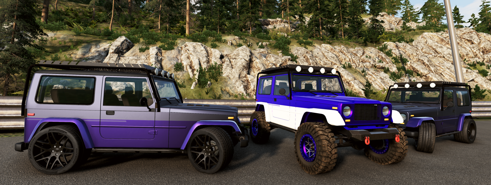

# UVSpec by the UltraViolet Collection

UVSpec by the UltraViolet Collection began as an indulgence—one man’s refusal to accept that even the world’s most elite machines could still feel… standard. A West Coast magnate with more taste than restraint set out to create something beyond the usual aftermarket excess: not louder, not flashier—just unquestionably better, in ways only a handful of people would ever notice or afford. To make it real, he disappeared into the Bavarian forest and resurfaced with a partner: a reclusive former ETK engineer whose ideas had once been deemed “impractical” by anyone concerned with budgets, regulations, or sanity. Together, they operate in near-total obscurity, quietly sourcing rare components, re-engineering systems from first principles, and pushing already exceptional vehicles far past their intended limits. Every UVSpec build is less a modification and more a reinterpretation—subtle where it should be, excessive where it can be, and uncompromising everywhere else.

Ultra prestige. Ultra performance. UltraViolet.

Presenting UVSpec from the UltraViolet Collection—the ultimate spec for the ultra discerning customer.

## The H-Wagen Project

The H-Wagen series marks the UltraViolet Collection’s first public release—though “public” is doing some heavy lifting. Long before anyone outside a very short client list knew the name, these builds were already circulating quietly, evolving behind closed doors. The starting point was simple, at least on paper: take the Ibishu Hopper and make it more… refined. Not sanitized, not softened—just elevated in ways the original never attempted.

What followed was less a tuning project and more a rethinking. Systems were rebuilt, not upgraded. Assumptions were discarded. The goal wasn’t to change what the Hopper is, but to explore what it could have been if compromise had never entered the equation. The result is the H-Wagen line: a range of machines that share a common origin but diverge wildly in execution, each one reflecting a different interpretation of excess, control, and intent.

It may be their first offering, but it was never meant to be their only one.

## Model Options:

### UVSpec H-Wagen Sport

The H-Wagen Sport represents UVSpec’s answer to a question nobody sensible asked: what if a lightweight utility platform were given just enough refinement and power to embarrass proper performance cars—without losing its edge? Producing 476HP through a meticulously tuned exhaust and paired with a precise 5-speed manual, the Sport walks a deliberate line between raw engagement and engineered control. UVSpec’s bespoke suspension and braking package sharpen the Hopper’s instincts, while the addition of ABS and an advanced AWD system—complete with traction and stability control—quietly rewrite its limits. It’s not the most extreme expression of the H-Wagen philosophy, but that’s the point: this is the one you could almost justify driving every day, assuming your definition of “reasonable” is flexible.

Starting at $777,777

### UVSpec H-Wagen SuperSport

If the H-Wagen Sport was an exercise in restraint, the SuperSport is what happens when UVSpec stops pretending. Output climbs to nearly 1,000HP, delivered through a race-derived 6-speed manual that feels less like a transmission and more like a commitment. The suspension is honed to an almost unreasonable degree, sacrificing comfort in favor of absolute control, while carbon ceramic brakes provide stopping power that borders on theatrical. The advanced AWD system remains, not as a safety net but as a necessity—barely containing the sheer force at play. The SuperSport isn’t an evolution; it’s an escalation, built for those who found the Sport version entirely too sensible and decided that “enough” was never really the goal.

Starting at $1,222,333

### UVSpec H-Wagen Off Road Sport

The Off Road Sport starts with the precision and power of the H-Wagen Sport, then politely ignores everything it learned about pavement. The advanced AWD system is replaced with a proper off-road transfer case and locking differentials, trading calculated grip for mechanical certainty when the terrain stops cooperating. Lifted springs rework the tuned suspension for articulation and clearance, while custom 17" wheels wrapped in 33" tires ensure it can actually use all 476HP somewhere far away from asphalt. It’s a deliberate contradiction—high-performance engineering repurposed for low-traction chaos—built for those who see a finely tuned machine not as something to preserve, but something to test.

Starting at $888,888
